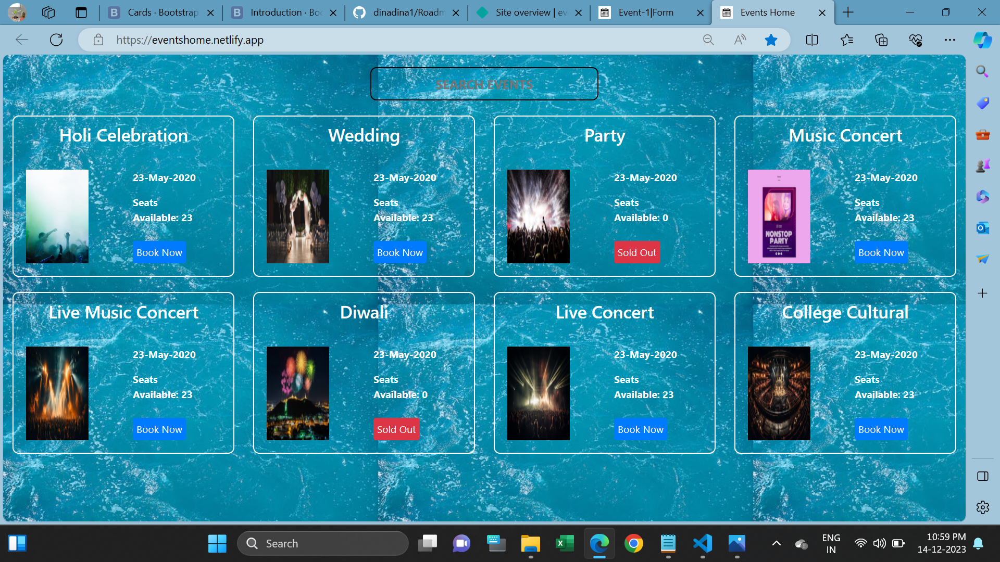

<h1>Event Searching Home page</h1>

This webpage is used to users can searching and booking seats an many Events. 

In this webpage willbe showing available event date and seats.

Users can booking a seats if available and if not available sold out button will be showing at the event.

I used Html, CSS and Bootstrap for creating the webpage.

I attached Webpage screenshot in below and find it.

<h2>Website URL</h2>
https://eventshome.netlify.app/
  
<h2>Screenshots</h2>

